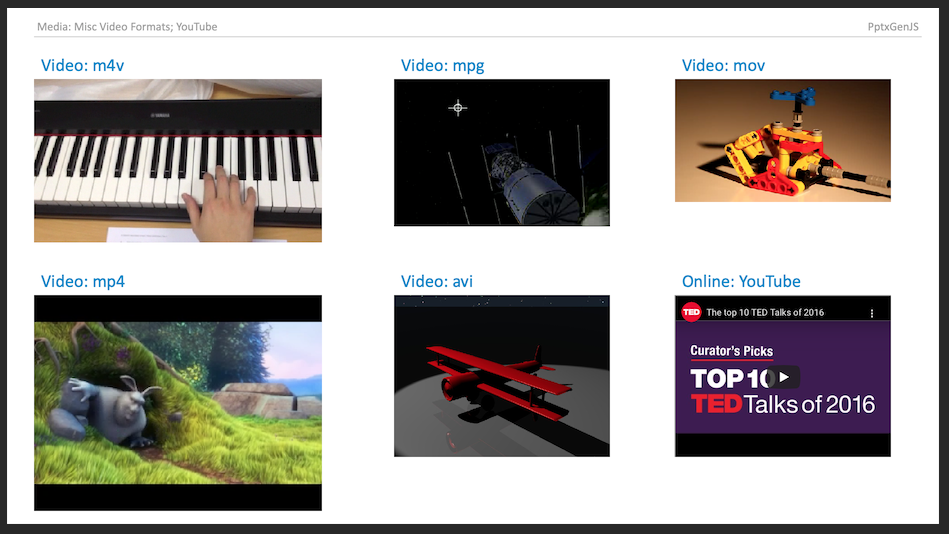

Media enables the addition of audio, video, and online video to Slides.

## Usage

```typescript
// Path: full or relative
slide.addMedia({ type: "video", path: "https://example.com/media/sample.mov" });
slide.addMedia({ type: "video", path: "../media/sample.mov" });

// Base64: pre-encoded string
slide.addMedia({ type: "audio", data: "audio/mp3;base64,iVtDafDrBF[...]=" });

// YouTube: Online video (supported in Microsoft 365)
slide.addMedia({ type: "online", link: "https://www.youtube.com/embed/Dph6ynRVyUc" });
```

### Usage Notes

Either provide a URL location or base64 data along with type to create media.

- `type` - type: media type
- `path` - URL: relative or full
- `data` - base64: string representing an encoded image

### Supported Formats and Notes

- Video (mpg, mov, mp4, m4v, et al.); Audio (mp3, wav, et al.); (see [Video and Audio file formats supported in PowerPoint](https://support.office.com/en-us/article/Video-and-audio-file-formats-supported-in-PowerPoint-d8b12450-26db-4c7b-a5c1-593d3418fb59#OperatingSystem=Windows))
- YouTube videos can be viewed using Microsoft 365/Office 365 (they may show errors on older desktop PowerPoint versions)
- Other online video sites may be supported as well (users have reported non-YouTube sites that worked)
- Not all platforms support all formats. For example, macOS can play MPG files while Windows typically cannot, and AVI support varies by codec. Verify playback on the target platform before distributing a presentation.

## Properties

### Position/Size Props (`PositionProps`)

| Option | Type   | Default | Description            | Possible Values                              |
| :----- | :----- | :------ | :--------------------- | :------------------------------------------- |
| `x`    | number | `1.0`   | hor location (inches)  | 0-n                                          |
| `x`    | string |         | hor location (percent) | 'n%'. (Ex: `{x:'50%'}` middle of the Slide)  |
| `y`    | number | `1.0`   | ver location (inches)  | 0-n                                          |
| `y`    | string |         | ver location (percent) | 'n%'. (Ex: `{y:'50%'}` middle of the Slide)  |
| `w`    | number | `1.0`   | width (inches)         | 0-n                                          |
| `w`    | string |         | width (percent)        | 'n%'. (Ex: `{w:'50%'}` 50% the Slide width)  |
| `h`    | number | `1.0`   | height (inches)        | 0-n                                          |
| `h`    | string |         | height (percent)       | 'n%'. (Ex: `{h:'50%'}` 50% the Slide height) |

### Data/Path Props (`DataOrPathProps`)

| Option | Type   | Description         | Possible Values                                             |
| :----- | :----- | :------------------ | :---------------------------------------------------------- |
| `data` | string | image data (base64) | (`data` or `path` is required) base64-encoded image string. |
| `path` | string | image path          | (`data` or `path` is required) relative or full URL         |

### Media Props (`MediaProps`)

| Option  | Type   | Description     | Possible Values                                                                         |
| :------ | :----- | :-------------- | :-------------------------------------------------------------------------------------- |
| `type`        | string  | media type       | `audio`, `video`, `online`, `audioCd` or `wav` — see [Media Types](#media-types)          |
| `cover`       | string  | cover image      | base64 encoded string of cover image                                                    |
| `extn`        | string  | media extension  | use when the media file path does not already have an extension, ex: "/folder/SomeSong" |
| `link`        | string  | external target  | an online video URL, or the path of a file to reference instead of embedding             |
| `contentType` | string  | MIME type        | written on `a:audioFile`/`a:videoFile`, ex: `video/mp4`                                   |
| `audioCd`     | object  | CD track range   | required for `type: 'audioCd'` — `{ start: { track, time? }, end: { track, time? } }`     |
| `isPhoto`     | boolean | photo frame      | marks the frame as a photo                                                              |
| `userDrawn`   | boolean | author-placed    | marks the frame as author-placed rather than layout furniture                             |

### Media Types

| Type      | Element           | Needs                | Media in the file?               |
| :-------- | :---------------- | :------------------- | :------------------------------- |
| `audio`   | `a:audioFile`     | `data`/`path`        | embedded                         |
| `video`   | `a:videoFile`     | `data`/`path`        | embedded                         |
| `audio`/`video` | `a:audioFile`/`a:videoFile` | `link` only | **linked** — referenced, not embedded |
| `online`  | `a:videoFile`     | `link`               | linked (YouTube-style URL)       |
| `audioCd` | `a:audioCd`       | `audioCd`            | nothing — reads the listener's CD |
| `wav`     | `a:wavAudioFile`  | `data`/`path`        | embedded WAV                     |

### Linked Media

Passing `link` with **no** `data` or `path` references the file instead of embedding it — the
relationship is written `TargetMode="External"` and no bytes go into the `.pptx`:

```typescript
slide.addMedia({ type: 'video', link: 'C:/movies/clip.mp4', x: 1, y: 1, w: 4, h: 3, contentType: 'video/mp4' });
```

The deck stays small, but it only plays where that path resolves. Give both `link` and `data`/`path`
and the media is embedded and `link` is ignored, with a warning.

### CD Audio

`type: 'audioCd'` references a track range on the listener's CD drive, so nothing is embedded and no
relationship is written. `start.track` and `end.track` are required by the OOXML schema, so
`addMedia()` throws without them. `time` is an offset into the track in seconds.

```typescript
slide.addMedia({ type: 'audioCd', audioCd: { start: { track: 1 }, end: { track: 1, time: 30 } }, x: 1, y: 1, w: 2, h: 2 });
```

### Embedded WAV

`type: 'wav'` emits `a:wavAudioFile`, the legacy element PowerPoint uses for short embedded sounds. It
carries no `p14:media` extension — that extension describes the modern embedded-media player, which
does not handle this element.

### Playback Props

These drive the slide timing tree (PowerPoint's Playback tab) and are all off by default. When none are set,
no `<p:timing>` element is written, so existing output is unchanged.

| Option       | Type    | Default | Description                                                                    |
| :----------- | :------ | :------ | :----------------------------------------------------------------------------- |
| `autoplay`   | boolean | `false` | start when the slide is shown instead of on click                              |
| `loop`       | boolean | `false` | repeat until the slide advances ("Loop until Stopped")                         |
| `fullScreen` | boolean | `false` | play video full-screen (`type: 'video'` only - ignored with a warning on audio) |
| `mute`       | boolean | `false` | mute the media's audio                                                         |

Playback options are not supported for `type: 'online'` (the embed handles playback) and are ignored with a
warning.

```typescript
slide.addMedia({ type: 'video', path: '../media/sample.mp4', x: 1, y: 1, w: 6, h: 3.4, autoplay: true, loop: true, mute: true });
```

## Example


