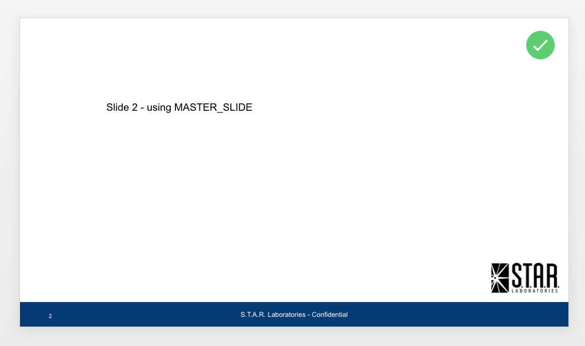
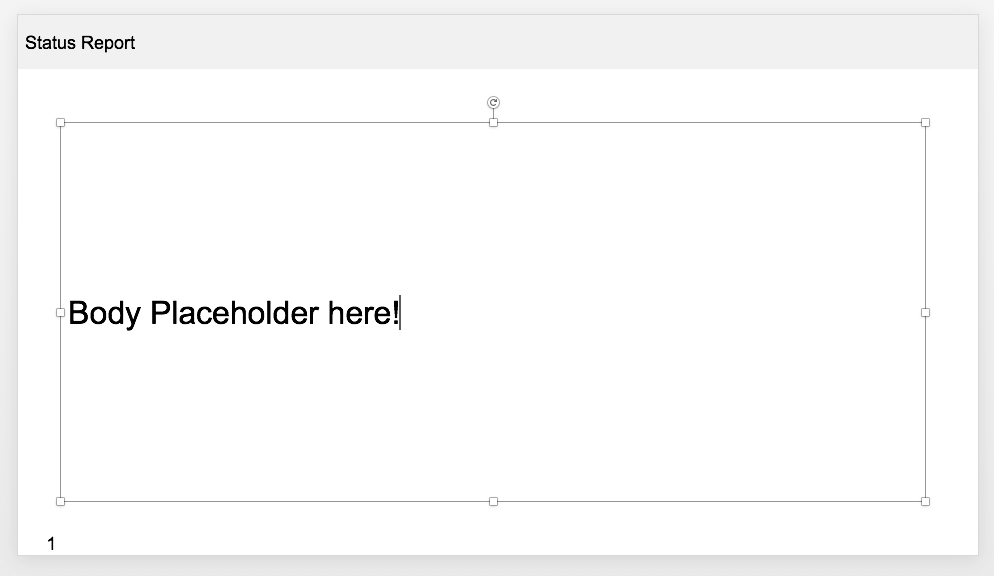
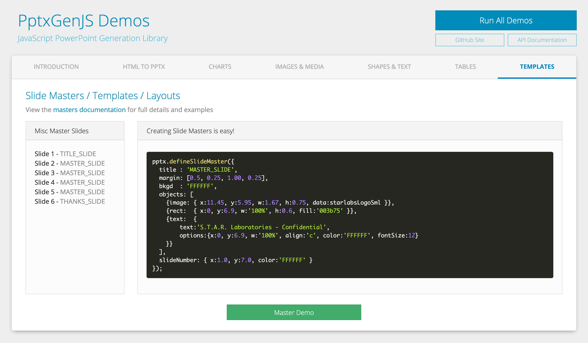

## Slide Masters

Most production presentations must follow a defined design or corporate branding. PptxGenJS supports this
through Slide Master Layouts, which are defined as plain objects and applied to slides, allowing a Master
Slide to be created entirely in code.

Create a Slide Master by calling the `defineSlideMaster()` method with an options object (the same style
used for Slides). Once defined, pass the Master title to `addSlide()` and that Slide will use the Layout
previously defined.

Defined Masters become first-class Layouts in the exported PowerPoint presentation. They can be edited via
View > Slide Master, and such edits affect all Slides created with that layout.

## Properties

### Slide Master Props (`SlideMasterProps`)

| Option        | Type             | Reqd? | Description       | Possible Values                                                       |
| :------------ | :--------------- | :---- | :---------------- | --------------------------------------------------------------------- |
| `title`       | string           | Y     | Layout title/name | unique name for this Master                                           |
| `background`  | BackgroundProps  |       | background props  | (see [Background Props](#background-props-backgroundprops))           |
| `margin`      | number           |       | Slide margins     | (inches) 0.0 through Slide.width                                      |
| `margin`      | array            |       | Slide margins     | (inches) array of numbers in TRBL order. Ex: `[0.5, 0.75, 0.5, 0.75]` |
| `objects`     | array            |       | Objects for Slide | object with type and options.                                         |
| `slideNumber` | SlideNumberProps |       | Slide numbers     | (see [SlideNumber Props](#slidenumber-props-slidenumberprops))        |

### Layout Metadata

These describe the layout part itself rather than its contents. All are optional, and unset means the
layout part is byte-identical to what earlier versions wrote.

```typescript
pptx.defineSlideMaster({
    title: 'SECTION HEADER',
    layoutType: 'secHead',
    matchingName: 'Section Header',
    colorMapOverride: { bg1: 'dk1', tx1: 'lt1' },
    objects: [/* ... */],
});
```

| Option                           | Type    | Default | Description                                                     |
| :------------------------------- | :------ | :------ | :-------------------------------------------------------------- |
| `layoutType`                     | string  | `cust`  | which placeholder arrangement the layout describes (`@type`)     |
| `matchingName`                   | string  |         | name shown in PowerPoint's New Slide gallery                     |
| `preserve`                       | boolean | `true`  | keep the layout even when no slide uses it                       |
| `showMasterShapes`               | boolean | `true`  | draw the master's shapes behind slides using this layout          |
| `showMasterPlaceholderAnimation` | boolean | `true`  | play the master's placeholder animations                         |
| `userDrawn`                      | boolean | `false` | mark the layout as author-drawn rather than generated             |
| `colorMapOverride`               | object  |         | remap the theme's colour slots for this layout only              |
| `transition`                     | object  |         | transition for slides using this layout                          |

`layoutType` is what PowerPoint's New Slide gallery groups by, and what its Reset Layout command
trusts. It *describes* the placeholder arrangement — PowerPoint takes it at face value, so a
`secHead` layout whose placeholders look nothing like a section header will reset oddly. Common
values: `title`, `obj`, `secHead`, `twoObj`, `titleOnly`, `blank`, `objTx`, `picTx`, `vertTx`,
`vertTitleAndTx`, `cust`. The full set is the 36 values of `ST_SlideLayoutType`.

`matchingName` unset writes nothing; PowerPoint then falls back to the layout name taken from `title`.

#### Colour Map Override

By default a layout inherits the master's colour mapping. `colorMapOverride` remaps individual slots —
useful for a dark section layout inside a light deck:

```typescript
colorMapOverride: { bg1: 'dk1', tx1: 'lt1' }
```

Slots are `bg1`, `tx1`, `bg2`, `tx2`, `accent1`–`accent6`, `hlink`, `folHlink`; each takes `dk1`,
`lt1`, `dk2`, `lt2`, `accent1`–`accent6`, `hlink` or `folHlink`. The OOXML schema requires all twelve,
so anything you leave out is filled from the identity map — exactly what inheriting would have done.

### Background Props (`BackgroundProps`)

| Option         | Type   | Default  | Description  | Possible Values                                                                                      |
| :------------- | :----- | :------- | :----------- | :--------------------------------------------------------------------------------------------------- |
| `color`        | string | `000000` | color        | hex color code or [scheme color constant](./shapes-and-schemes). Ex: `{line:'0088CC'}` |
| `transparency` | number | `0`      | transparency | Percentage: 0-100                                                                                    |

### SlideNumber Props (`SlideNumberProps`)

| Option  | Type   | Default  | Description                  | Possible Values                                                                                      |
| :------ | :----- | :------- | :--------------------------- | :--------------------------------------------------------------------------------------------------- |
| `x`     | number | `1.0`    | horizontal location (inches) | 0-n OR 'n%'. (Ex: `{x:'50%'}` will place object in the middle of the Slide)                          |
| `y`     | number | `1.0`    | vertical location (inches)   | 0-n OR 'n%'.                                                                                         |
| `w`     | number |          | width (inches)               | 0-n OR 'n%'. (Ex: `{w:'50%'}` will make object 50% width of the Slide)                               |
| `h`     | number |          | height (inches)              | 0-n OR 'n%'.                                                                                         |
| `align` | string | `left`   | alignment                    | `left` or `center` or `right`                                                                        |
| `color` | string | `000000` | color                        | hex color code or [scheme color constant](./shapes-and-schemes). Ex: `{line:'0088CC'}` |

### NOTES

- Slide Number: more props are available than shown above - `SlideNumberProps` inherits from [TextProps](./api-text)
- Pre-encode images (base64) and add the string as the optional data key/val (see `bkgd` above)

## Examples

### Slide Master Example

```typescript
let pptx = new PptxGenJS();
pptx.layout = "LAYOUT_WIDE";

pptx.defineSlideMaster({
 title: "MASTER_SLIDE",
 background: { color: "FFFFFF" },
 objects: [
  { line: { x: 3.5, y: 1.0, w: 6.0, line: { color: "0088CC", width: 5 } } },
  { rect: { x: 0.0, y: 5.3, w: "100%", h: 0.75, fill: { color: "F1F1F1" } } },
  { text: { text: "Status Report", options: { x: 3.0, y: 5.3, w: 5.5, h: 0.75 } } },
  { image: { x: 11.3, y: 6.4, w: 1.67, h: 0.75, path: "images/logo.png" } },
 ],
 slideNumber: { x: 0.3, y: "90%" },
});

let slide = pptx.addSlide({ masterName: "MASTER_SLIDE" });
slide.addText("How To Create PowerPoint Presentations with JavaScript", { x: 0.5, y: 0.7, fontSize: 18 });

pptx.writeFile();
```

### Slide Master Example Output

Using the 'MASTER_SLIDE' defined above to produce a Slide:


## Placeholders

Placeholders are supported in PptxGenJS.

Add a `placeholder` object to a Master Slide using a unique name, then reference that placeholder
name when adding text or other objects.

### Placeholder Types

| Type    | Description |
| :------ | :---------- |
| `title` | slide title |
| `body`  | body area   |
| `image` | image       |
| `chart` | chart       |
| `table` | table       |
| `media` | audio/video |

### Placeholder Metadata

Beyond position and type, a placeholder can carry the OOXML metadata PowerPoint reads when it lays a
new slide out:

| Option      | Type    | Default | Description                                                      |
| :---------- | :------ | :------ | :--------------------------------------------------------------- |
| `orient`    | string  | `horz`  | text direction inside the placeholder — `horz` or `vert`           |
| `sz`        | string  | `full`  | how much of the layout it covers — `full`, `half` or `quarter`      |
| `userDrawn` | boolean | `false` | author-placed rather than inherited layout furniture               |

```typescript
objects: [
    { placeholder: { options: { name: 'side', type: 'body', x: 6, y: 1, w: 3, h: 4, orient: 'vert', sz: 'half' } } },
];
```

`sz` matches the OOXML attribute name, as `orient` does — `size` is already taken elsewhere in the
options surface.

### Placeholder Example

```typescript
let pptx = new PptxGenJS();
pptx.layout = "LAYOUT_WIDE";

pptx.defineSlideMaster({
 title: "PLACEHOLDER_SLIDE",
 background: { color: "FFFFFF" },
 objects: [
  { rect: { x: 0, y: 0, w: "100%", h: 0.75, fill: { color: "F1F1F1" } } },
  { text: { text: "Status Report", options: { x: 0, y: 0, w: 6, h: 0.75 } } },
  {
   placeholder: {
    options: { name: "body", type: "body", x: 0.6, y: 1.5, w: 12, h: 5.25 },
    text: "(custom placeholder text!)",
   },
  },
 ],
 slideNumber: { x: 0.3, y: "95%" },
});

let slide = pptx.addSlide({ masterName: "PLACEHOLDER_SLIDE" });

// Add text, charts, etc. to any placeholder using its `name`
slide.addText("Body Placeholder here!", { placeholder: "body" });

pptx.writeFile();
```

### Placeholder Example Output

Using the 'PLACEHOLDER_SLIDE' defined above to produce a Slide:


## More Examples

A presentation built from several defined Master Slides, including placeholder examples:


