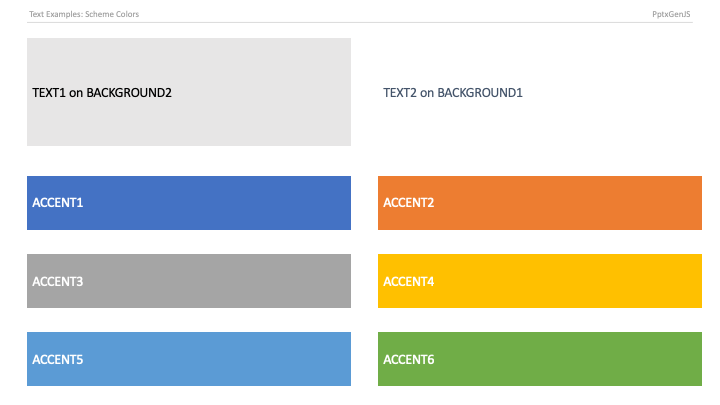

## PowerPoint Shape Types

The library ships every built-in PowerPoint shape — over 180 of them (rectangles, ovals, arrows, callouts,
stars, connectors, and more), originally provided by the [officegen project](https://github.com/Ziv-Barber/officegen).
Shapes are enumerated on the instance as `pptx.ShapeType`; editor autocompletion on this enum is the fastest
way to discover the available shapes. The complete enum is also defined in
[`index.d.ts`](https://github.com/NeomaVerwaltung/PptxGenJS/blob/master/types/index.d.ts).

Add a shape with `slide.addShape(type, options)`. The options control fill, line, and position:

```typescript
// A filled rounded rectangle
slide.addShape(pptx.ShapeType.roundRect, {
	x: 1, y: 1, w: 3, h: 1.5,
	fill: { color: "0088CC" },
	line: { color: "004466", width: 1 },
})

// Shapes can also back a text box — pass `shape` to addText
slide.addText("Label", { shape: pptx.ShapeType.ellipse, x: 5, y: 1, w: 2, h: 2, fill: { color: "ED7D31" }, align: "center" })
```

See [Shapes API](./api-shapes) for the full list of shape options.

## PowerPoint Scheme Colors

A scheme color is a reference to a slot in the presentation's theme rather than a fixed hex value. When a
viewer switches the theme (or you apply a different template), everything painted with a scheme color
updates automatically — so text stays readable against backgrounds and the deck keeps a consistent palette.
Prefer scheme colors over hardcoded hex when you want a deck to adapt to corporate templates.

The ten slots map to PowerPoint's theme: two text colors, two background colors, and six accents. Reference
them through `pptx.SchemeColor`; the complete enum is in
[`index.d.ts`](https://github.com/NeomaVerwaltung/PptxGenJS/blob/master/types/index.d.ts).

```typescript
slide.addText("Themed heading", { color: pptx.SchemeColor.accent1 })
slide.addShape(pptx.ShapeType.rect, { x: 1, y: 3, w: 4, h: 1, fill: { color: pptx.SchemeColor.background2 } })
```




```typescript
export enum SchemeColor {
    "text1" = "tx1",
    "text2" = "tx2",
    "background1" = "bg1",
    "background2" = "bg2",
    "accent1" = "accent1",
    "accent2" = "accent2",
    "accent3" = "accent3",
    "accent4" = "accent4",
    "accent5" = "accent5",
    "accent6" = "accent6",
}
```

## The Full Colour Model

Anywhere a colour is accepted, you can pass a 6-digit hex string, a theme slot name, or an object
that reaches the rest of the DrawingML colour model (ECMA-376 §20.1.2.3).

```typescript
slide.addShape(pptx.ShapeType.rect, { x: 1, y: 1, w: 3, h: 1, fill: { color: 'FF0000' } });                       // unchanged
slide.addShape(pptx.ShapeType.rect, { x: 1, y: 3, w: 3, h: 1, fill: { color: { scheme: 'accent1', lumMod: 60, lumOff: 40 } } });
slide.addText('linked', { x: 1, y: 5, w: 3, h: 1, color: { scheme: 'hlink' } });
```

### Specifying a colour

Exactly one of these identifies the colour:

| Field    | Emits         | Example                                    |
| :------- | :------------ | :----------------------------------------- |
| `hex`    | `a:srgbClr`   | `{ hex: 'FF0000' }`                        |
| `scheme` | `a:schemeClr` | `{ scheme: 'accent1' }`                    |
| `system` | `a:sysClr`    | `{ system: 'windowText', lastColor: '000000' }` |
| `preset` | `a:prstClr`   | `{ preset: 'cornflowerBlue' }` (140 names) |
| `hsl`    | `a:hslClr`    | `{ hsl: { hue: 210, sat: 80, lum: 50 } }`  |
| `scrgb`  | `a:scrgbClr`  | `{ scrgb: { r: 100, g: 50, b: 0 } }`       |

Theme slots now include `dk1`, `dk2`, `lt1`, `lt2`, `hlink`, `folHlink`, and `phClr` alongside
`tx1`/`tx2`/`bg1`/`bg2`/`accent1`–`accent6`.

### Transforms

Any number can be combined with any colour. Percentages are given as 0–100 and converted to the
1000ths DrawingML expects; `hueOff` is in degrees.

| Transform | Range | Notes |
| :-- | :-- | :-- |
| `tint`, `shade`, `alpha` | 0–100 | lighten, darken, opacity |
| `alphaMod`, `lumMod`, `satMod`, `hueMod` | 0–∞ | **scales**, so values above 100 are valid (themes use `satMod: 170`) |
| `alphaOff`, `lumOff`, `satOff` | −100–100 | signed shifts |
| `hueOff` | −360–360 | degrees |
| `complement`, `inverse`, `grayscale`, `gamma`, `inverseGamma` | boolean | emitted as empty elements |

An unknown `scheme`, `system`, or `preset` name falls back to the default text colour with a warning:
each is a schema enum, and an unrecognised token makes the element unparseable.
